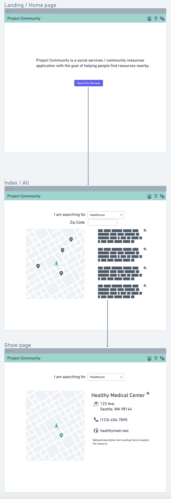

# project_community
## Project Community - The Social Service / Community Resources Application
---
### Scope: What are you planning to build? What do you reasonably think you can implement in the time period?

Project Community [Name TBD], is an application meant to be a hub for all things that are social services / community resources. The barebones of the project is to have a Django/PostgreSQL database of social services that users can access to find contact info/locations for the services they need. Within the timeframe of about one week, realistically I believe full CRUD functionality could be implemented, with potential stretch goals for Community Resources API integration, language translation selector, interactive map/visualization functions, location/distance sorting, and third-party log-in. Within this timeframe completion of all these features do not seem likely, but are in mind for post-MVP.

---
### User Stories: Who is your user? What features will your app have? - Set up your project and user stories in Trello.

Project Community is aimed at aiding COVID-19 relief and those in the community overall that is in need of help. Given my background in work with the WA State Department of Social and Health Services, one of the joys was learning about all the social services and resources out there that could help people get back on their feet. If I could not personally help someone with their issue, at the least I could point them in the right direction to get the assistance that they need. In this time of pandemic I have had multiple friends and family that have been effected by COVID-19 and fortunately was able to share the knowledge of these services. Also in this time of pandemic it was apparent from my work with the state of WA that people would call in not knowing whats going on and just want an easy way to get up to date and get help. The goal of Project Community is to at a larger scale point people in the right direction for the assistance/services they need.

---
### Wireframes: Sketch out what your core pages will look like and how they will work. Consider making a paper prototype to demonstrate and/or test key user interactions.

---
### Data Models: Draw out the models and any associations for your project in an entity relationship diagram (ERD).
[See attached/To be attached]

---
### Milestones: Divide your work into parts - the most essential features for your MVP, features that are important but not essential, and features that can be saved for a later iteration. Create 3-5 major milestones with dates outlining when you expect essential features will be done.
    - Sprint 1

        - Get base Django localhost running
            - setup home/landing page route
        - Get base PostgreSQL database setup
            - setup resources entity

    - Sprint 2

        - Setup base CSS
            - Building navbar as adding routes
        - Setup full CRUD functionality for resources database
            - New Route
            - Index Route
            - Show Route
            - Edit Route
            - Delete Route

    - Bonus Sprint A [Possible]
        
        - Add Maps
            - Take Zip Code or Default user location
            - Populate Map with pins
            - Map directions
            - Location distance sorting

    - Bonus Sprint B [Possible]
        
        - Add Site Language Translator
        - Color Accessibility/High Contrast/Line height spacing/ Text Sizing [reader mode button?]

    - Bonus Sprint C [Possible]
        
        - Add Community Resources API

    - Bonus Sprint D [Lower Feasibility]

        - Add Users
        - Add Third-Party Login
        - Add user dashboard/route and to-do list/notes organizational tool [Stretch goal out of timeframe/scope/feasibility]
        

---
### Feasibility Study: If you're using an external API or scraping a website, make sure you can get that data. If you're using a new language, framework, or tool, go through its getting started tutorial. We will ask to see your results.
Everything up until the bonus sprints appear feasible. Potentially implementing possibly 2 of the bonus sprints A-C seem possible. The core functionality prior to the bonus sprints are workable, but bonus features A and B of Map and Language translator appear to have the highest impact for utility and accessibility. Bonus C of API integration may add more data, but may have issues with compatability/integration of multiple sources as it appears most resources are separated per the resource type and combining them may have some issues/missing data. Bonus D only seems useful with additional features such as dashboard an to-do list/notes which are not the primary focus of this application and although useful could ask some risk factors to account for for having user data. Users is not required as access is intended for everyone to have and view info.